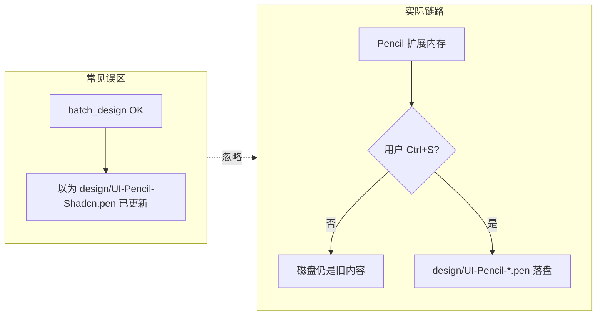

# Pencil 踩坑总结与操作指南

本文档汇总本项目在 Cursor + Pencil 扩展下使用 `.pen` 设计稿的真实经验，供本人或 Agent 操作时快速避坑。

- 项目总览与六皮肤架构：[AGENTS.md](../AGENTS.md)
- **站点内容真相源**：[`content/site.json`](../content/site.json) → `useSiteContent()`（六皮肤共用）
- **简历归档**：[`简历内容.md`](../简历内容.md) → 手动 `npm run content:import` 导入内容层
- 站点壳层 UI（皮肤切换器、a11y）：[`src/config/siteCopy.ts`](../src/config/siteCopy.ts)

---

## 1. Pencil 在 Cursor 里怎么工作

### 1.1 Extension MCP vs 手动 MCP 列表

Pencil **不需要**在 Cursor Settings → MCP 里手动注册 server。

它走的是 **Extension MCP** 模式：

- 安装并启用 Pencil Cursor 扩展后，打开 `.pen` 文件时，Cursor 会自动注入 MCP 工具
- 会话中可见 server 名：`user-highagency.pencildev-extension-pencil`
- 工具描述文件：`mcps/user-highagency.pencildev-extension-pencil/tools/*.json`

**要点**：Agent 能调用 Pencil MCP ≠ 改的是项目目录里的文件。MCP 绑定的是 **Pencil 扩展当前打开的编辑器会话**，而不是命令里写的任意路径。

### 1.2 `.pen` 文件格式

- `.pen` 是 Pencil 的**加密/专有格式**，不能用普通 `Read` / `Grep` / 文本编辑器直接查看或编辑
- 必须通过 Pencil MCP 工具访问
- 官方说明：*access them only via "pencil" MCP tools — never use Read or Grep on .pen files*

### 1.3 MCP 工具一览

| 工具 | 用途 |
|------|------|
| `get_editor_state` | 查看当前活动文档路径、选区、schema；**每次操作前先调用** |
| `batch_design` | Insert / Update / Delete / SetVariables 等编辑指令 |
| `batch_get` | 读取节点树，验证 bootstrap / 查找 Desktop id |
| `export_html` | 导出节点为 HTML+Tailwind，写入 `outputPath` |
| `export_nodes` | 导出节点为其它格式 |
| `get_variables` | 导出设计变量（多 tab 时易串，见坑 6） |
| `get_guidelines` | 加载 Design System 风格指南 |
| `get_screenshot` | 截图验证视觉效果 |
| `snapshot_layout` | 读取布局度量 |

**规范**：若上下文中没有当前 `.pen` 的 schema，必须先：

```json
get_editor_state({ "include_schema": true })
```

### 1.4 内存编辑 vs Ctrl+S 落盘

这是本项目**最重要**的机制：

```
Agent batch_design → Pencil 扩展内存（即时可见）
                        ↓
                  用户 Ctrl+S
                        ↓
              design/UI-Pencil-*.pen 写入磁盘
```

- MCP 返回 OK **只表示内存编辑成功**，不保证磁盘文件已更新
- 用 `Copy-Item` 复制 `.pen` 只会复制磁盘上的旧内容，**不会**包含 MCP 内存里刚画的内容
- 验证落盘：保存后检查文件大小/行数是否明显变化（welcome 壳约 9976B → 完整稿 600+ 行）



---

## 2. 本项目设计文件约定

### 2.1 六皮肤与 `.pen` 对应关系

| 设计稿 | 皮肤 ID | 网页实现 |
|--------|---------|----------|
| — | `skill-frontend-design` | `src/skins/skill/frontend-design/` |
| — | `skill-ui-ux-pro-max` | `src/skins/skill/ui-ux-pro-max/` |
| — | `skill-design-taste` | `src/skins/skill/design-taste/` |
| `design/UI-Pencil-Shadcn.pen` | `pencil-shadcn` | `src/skins/pencil/shadcn/` |
| `design/UI-Pencil-Lunaris.pen` | `pencil-lunaris` | `src/skins/pencil/lunaris/` |
| `design/UI-Pencil-Halo.pen` | `pencil-halo` | `src/skins/pencil/halo/` |

旧 `UI-Dark/Glass/Brutalist.pen` 见 [`design/archive/`](archive/)。

### 2.2 禁止修改的文件

| 文件 | 说明 |
|------|------|
| `~/.pencil/documents/.../pencil-welcome.pen` | Pencil 内置欢迎模板，**不要**写入项目简历设计 |
| `design/_welcome-backup.pen` | 仅作 welcome 备份参考 |

项目设计内容必须放在 `design/UI-Pencil-{Shadcn|Lunaris|Halo}.pen`，并纳入 git 管理。

### 2.3 设计 ↔ 网页同步范围

**页面文案与区块**（姓名、项目、联系方式、区块标题等）：六皮肤共用 [`content/site.json`](../content/site.json) → `useSiteContent()`。

**简历归档导入**（低频）：[`简历内容.md`](../简历内容.md) → `parseResume()` → `npm run content:import`（默认 `--merge`）写入 `content/site.json`。改 md **不会**自动改站，需手动触发 import。

**布局与样式**：

| 皮肤类型 | 布局来源 | 主题 CSS |
|----------|----------|----------|
| Skill ×3 | `src/skins/shared/ContentBlocks.tsx` + 各 `*Page.tsx` | `src/index.css` `[data-theme="skill-..."]` |
| Pencil ×3 | `export_html` → `components/*` + `useSiteContent()` 绑定 | `src/index.css` `[data-theme="pencil-..."]` |

**Pencil 文案同步**（content → .pen）：

```bash
npm run pen:hydrate:halo    # 或 lunaris / shadcn — 打印 layer 对照表
# Agent: batch_get → batch_design Update → Ctrl+S
```

**Pencil 文案回写**（.pen → content）：Agent `batch_get` 提取 layer 文本 → 写入 `design/pen-extract-{theme}.json` → `npx tsx scripts/pen-extract-content.ts halo design/pen-extract-halo.json`

Pencil 皮肤的 Layer 绑定约定见各目录：

- `src/skins/pencil/shadcn/export/README.md` + `layer-map.ts`
- `src/skins/pencil/lunaris/export/README.md` + `layer-map.ts`
- `src/skins/pencil/halo/export/README.md` + `layer-map.ts`

**注意**：`export_html` 的 `outputPath` 必须使用**项目绝对路径**，否则可能写到错误目录。

主题变量内联于 [`src/index.css`](../src/index.css)。旧 Dark/Glass/Brutalist token 管道与 `*.generated.css` 已从仓库移除。

---

## 3. Agent MCP 调用手册

### 3.1 前置条件

1. 在 Pencil 中**只打开一个**目标 `.pen`，关闭其它 `.pen` tab
2. 调用 `get_editor_state({ include_schema: true })`，确认 `activeFilePath` 正确
3. 所有 `filePath` 参数使用项目内相对路径，如 `design/UI-Pencil-Shadcn.pen`

### 3.2 初始化 / 补全设计稿

```bash
npm run pen:export:shadcn   # 或 lunaris / halo — 打印 bootstrap + export 步骤
```

Agent 将 `scripts/pen-bootstrap-{shadcn|lunaris|halo}.js` 内容作为 `batch_design` 的 operations 传入，然后：

- [ ] `batch_get` 验证：有 Desktop + Mobile，含 Hero / About / Projects / Contact
- [ ] 提醒用户 **Ctrl+S**
- [ ] 确认磁盘行数已变化

### 3.3 布局变更 → 同步到 React

```bash
npm run pen:export:shadcn   # 查看该主题的 Desktop 节点 id 与 outputPath 模板
```

**步骤：**

1. 在 Pencil 中改布局 → **Ctrl+S**
2. `batch_get` 确认 Desktop 节点 id（见 §3.4 已知 id）
3. 调用 `export_html`：

```json
{
  "filePath": "design/UI-Pencil-Shadcn.pen",
  "nodeIds": ["yc9zJ"],
  "outputPath": "C:/Users/47090/Desktop/personal/resume/src/skins/pencil/shadcn/export/desktop.html",
  "format": "html-tailwind",
  "includeLayerNames": true
}
```

4. Agent 将 HTML 转为 React，更新 `src/skins/pencil/{theme}/components/*.tsx` 的 **LAYOUT**
5. **保留 BINDINGS**：动态字段仍绑定 `useSiteContent()`，按 `layer-map.ts` 映射

**Layer 名 → 数据绑定示例：**

| Layer 名 | 数据源 |
|----------|--------|
| `Hero/Headline` | `useSiteContent()` hero `headline` |
| `Hero/Tagline` | `useSiteContent()` hero `tagline` |
| `Section/Projects` | projects 块 `title` |
| `Card/Project` | projects 块 `items.map(...)` |

### 3.4 各主题已知 Desktop 节点 id

| 主题 | `.pen` 文件 | Desktop id | export 目录 |
|------|-------------|------------|-------------|
| shadcn | `UI-Pencil-Shadcn.pen` | `yc9zJ` | `src/skins/pencil/shadcn/export/` |
| lunaris | `UI-Pencil-Lunaris.pen` | `HwWCW` | `src/skins/pencil/lunaris/export/` |
| halo | `UI-Pencil-Halo.pen` | `N4q5X` | `src/skins/pencil/halo/export/` |

id 可能随 bootstrap 变化；re-bootstrap 后务必用 `batch_get` 重新确认。

### 3.5 颜色 / 主题 token 变更

不经过 export_html，直接编辑 [`src/index.css`](../src/index.css) 中对应 `[data-theme="pencil-..."]` 块。

可选：在 Pencil 中改变量 → `get_variables`（单 tab）→ 手动对照更新 `index.css`。

### 3.6 视觉验证

```bash
npm run dev
npm run capture:design-ref   # 输出 design/refs/*.png + layout.json
```

或在 MCP 中：`get_screenshot`、`snapshot_layout`。

---

## 4. 踩坑复盘

按严重度排列，均为本项目真实发生过的问题（部分示例来自旧 Dark/Glass/Brutalist 阶段，机制仍适用）。

### 坑 1：设计画在 welcome 内置文档，项目目录无 `.pen`

**现象**：`batch_design` 传了 `filePath: design/...`，返回 OK，但项目 `design/` 下无变化。

**原因**：活动文档是 `~/.pencil/.../pencil-welcome.pen`，MCP 写入的是当前打开的文档。

**教训**：操作前 `get_editor_state` 确认路径；必须在 Pencil 中打开项目内 `.pen` 并保存。

### 坑 2：Copy-Item 复制 `.pen`，磁盘全是 welcome 模板

**原因**：复制的是磁盘旧壳；MCP 绘制内容在内存，未 Ctrl+S。

**教训**：复制只能当起点；内容靠 `batch_design` + **Ctrl+S**。

### 坑 3：内存有完整稿，未保存就 destructive 操作 → 丢失

**教训**：Delete / restore / isolate 之前，必须先 bootstrap → Ctrl+S → 验证落盘。

### 坑 4：多个 `.pen` tab 同时 bootstrap → 文档 merge

**现象**：连续 bootstrap 三个文件后，画布出现多套 Desktop，变量互相覆盖。

**教训**：**每次只打开一个** `.pen`；bootstrap → Ctrl+S → 关闭 tab → 下一个。

### 坑 5：未 Ctrl+S，Agent 误判「已落盘」

**现象**：`batch_get` 能看到节点，但 `git diff` 无 `.pen` 变化。

**教训**：`batch_get` 读内存；磁盘变化需用户 Ctrl+S 后才可信。

### 坑 6：`get_variables` 多 tab 时变量串主题

**现象**：对不同 `.pen` 调用 `get_variables`，返回同一套变量。

**教训**：导出前**只打开目标 `.pen`**；或直接改 `src/index.css`。

### 坑 7：误以为 `filePath` 会自动创建并落盘

**教训**：文件需已在 Pencil 中打开；落盘依赖 Ctrl+S。

### 坑 8：`export_html` 的 `outputPath` 用相对路径 → 写到错误位置

**教训**：`outputPath` 使用项目**绝对路径**，如 `C:/Users/47090/Desktop/personal/resume/src/skins/pencil/shadcn/export/desktop.html`。

### FAQ：扩展 MCP 与踩坑的关系

| 问题 | 答案 |
|------|------|
| 要不要手动注册 Pencil MCP？ | **不需要**，打开 `.pen` 时扩展自动注入 |
| 踩坑是 MCP 没注册导致的吗？ | **不是**。根因是内存/落盘、活动文档绑定、多 tab 污染 |
| 工具成功 = 网页已更新？ | **否**。布局需 re-export + 改 React；颜色需改 `index.css` |

---

## 5. 脚本与 npm 命令

### 5.1 当前主脚本

| 脚本 | 用途 |
|------|------|
| `pen-bootstrap-shadcn.js` | Shadcn 设计稿 bootstrap（`batch_design` 输入） |
| `pen-bootstrap-lunaris.js` | Lunaris bootstrap |
| `pen-bootstrap-halo.js` | Halo bootstrap |
| `pen-export-theme.mjs` | 打印 export_html 工作流 + bootstrap 内容 |
| `content-import-resume.ts` | 简历 md → `content/site.json` |
| `pen-hydrate-content.ts` | content → Pencil layer 对照表 |
| `pen-extract-content.ts` | Pencil 提取 JSON → `site.json` |
| `capture-design-ref.mjs` | Playwright 六皮肤截图 + layout.json |

```bash
npm run content:import
npm run content:import:fresh
npm run pen:export:shadcn
npm run pen:hydrate:halo
npm run capture:design-ref
```

### 5.2 已移除的历史产物（Dark/Glass/Brutalist）

旧三皮肤相关的 `design/tokens/`、`*.generated.css`、`design:sync*` 脚本与 `pen-bootstrap-{dark,glass,brutalist}.js` 等已从仓库删除。对应 `.pen` 仍保留在 [`design/archive/`](archive/) 供参考，不参与六皮肤构建。

---

## 6. 排查 FAQ

### 「pen 看起来还是 welcome 空壳」

- 未执行 `pen-bootstrap-{shadcn,lunaris,halo}.js`
- 或 bootstrap 后未 **Ctrl+S**
- 解决：单文件打开 → bootstrap → 保存 → 检查行数

### 「改了 pen，网页布局没变」

- 只改了 `.pen` 内存/磁盘，未 `export_html` + 更新 React 组件
- 解决：走 §3.3 完整 export 流程

### 「改了 pen 颜色，网页没变」

- 当前 pipeline 不自动同步 Pencil 变量到 CSS
- 解决：改 `src/index.css` 对应 `[data-theme]` 块

### 「get_variables 多个主题返回相同值」

- 多 tab 打开或活动 tab 不对
- 解决：只开目标 `.pen`；或跳过变量导出，直接改 CSS

### 「Agent 说设计已完成，git diff 没有 .pen 变化」

- MCP 编辑在内存，用户未保存
- 解决：Pencil 中 Ctrl+S → `git status`

### 「能否用 Read 工具查看 .pen？」

- **不能**。必须用 `batch_get` 等 Pencil MCP 工具。

---

## 7. Agent 操作规范（Checklist）

1. **操作前**：`get_editor_state({ include_schema: true })`，确认 `activeFilePath`
2. **一次一个 theme**：不要连续 bootstrap 三个 `.pen` 而不关闭 tab
3. **batch_design 后**：提醒用户 **Ctrl+S**；`batch_get` 验证结构
4. **不要**单独用磁盘 hash 判断 MCP 是否成功（除非用户已保存）
5. **不要**在 `pencil-welcome.pen` 中创建项目设计
6. **不要**用 Read/Grep 读取 `.pen`
7. **export_html**：`outputPath` 用绝对路径；保留 React 侧 `useSiteContent()` 绑定
8. **destructive 操作前**：确认目标 theme 已 Ctrl+S 落盘
9. **改页面文案**：编辑 `content/site.json`；从简历同步用 `npm run content:import`
10. **改简历归档**：编辑 `简历内容.md` 后手动 `content:import`；不会自动改站
11. **改站点壳层**（皮肤切换器、a11y）：编辑 `src/config/siteCopy.ts`

---

## 8. 相关文件

| 路径 | 说明 |
|------|------|
| [AGENTS.md](../AGENTS.md) | 六皮肤架构与日常 workflow |
| [src/index.css](../src/index.css) | 六皮肤主题 CSS 变量 |
| [content/site.json](../content/site.json) | 站点展示内容真相源 |
| [src/hooks/useSiteContent.ts](../src/hooks/useSiteContent.ts) | 内容层 Hook |
| [src/lib/parseResume.ts](../src/lib/parseResume.ts) | 简历 Markdown 解析（import 用） |
| `design/refs/*.png` | 六皮肤参考截图（`npm run capture:design-ref` 生成，未提交时可空目录） |
| `design/refs/layout.json` | 布局度量（同上，可再生） |
| `design/archive/` | UI-Dark/Glass/Brutalist 旧稿 |

---

## 9. Design Goodies → Design Systems

Pencil 内置三套预制设计系统（非 npm 包）：

- **Shadcn UI** — 语义 token（primary / muted / card），适合 export 成 Tailwind
- **Lunaris** — Pencil curated 深色 refined 套件
- **Halo** — Pencil curated 柔和光感套件

在 Pencil UI 中选择套件，或通过 MCP：

```json
get_guidelines({ "category": "style", "name": "..." })
```

（需先打开对应 `.pen`）

### Pencil 皮肤当前状态（2026-06）

三套均已采用 **export_html + `useSiteContent()` 绑定**，各页入口：

- [`ShadcnPencilPage.tsx`](../src/skins/pencil/shadcn/ShadcnPencilPage.tsx)
- [`LunarisPencilPage.tsx`](../src/skins/pencil/lunaris/LunarisPencilPage.tsx)
- [`HaloPencilPage.tsx`](../src/skins/pencil/halo/HaloPencilPage.tsx)

Skill 三皮肤共用 [`ContentBlocks.tsx`](../src/skins/shared/ContentBlocks.tsx) 块渲染；Pencil 三皮肤为各主题独立布局组件，数据均来自 `content/site.json`。
