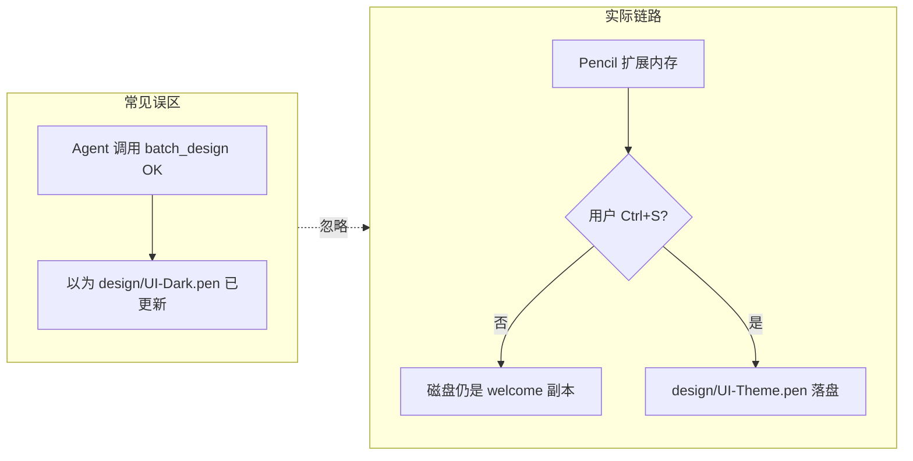

# Pencil 踩坑总结与经验文档

本文档汇总本项目在 Cursor + Pencil 扩展下使用 `.pen` 设计稿的真实经验，供本人或 Agent 下次操作时快速避坑。日常 workflow 见 [AGENTS.md](../AGENTS.md) 的「Design ↔ Code」章节。

---

## 1. Pencil 在 Cursor 里怎么工作

### 1.1 Extension MCP vs 手动 MCP 列表

Pencil **不需要**在 Cursor Settings → MCP 里手动注册 server。

它走的是 **Extension MCP** 模式：

- 安装并启用 Pencil Cursor 扩展后，打开 `.pen` 文件时，Cursor 会自动注入 MCP 工具
- 会话中可见 server 名：`user-highagency.pencildev-extension-pencil`（`extension-pencil`）
- 工具描述文件出现在 Cursor 项目下的 `mcps/user-highagency.pencildev-extension-pencil/tools/`

**要点**：Agent 能调用 Pencil MCP ≠ 改的是项目目录里的文件。MCP 绑定的是 **Pencil 扩展当前打开的编辑器会话**，而不是你在命令里写的任意路径。

### 1.2 `.pen` 文件格式

- `.pen` 是 Pencil 的**加密/专有格式**，不能用普通 `Read` / `Grep` / 文本编辑器直接查看或编辑
- 必须通过 Pencil MCP 工具访问：`get_editor_state`、`batch_get`、`batch_design`、`get_variables` 等
- 官方说明：*access them only via "pencil" MCP tools — never use Read or Grep on .pen files*

### 1.3 常用 MCP 工具

| 工具 | 用途 |
|------|------|
| `get_editor_state` | 查看当前活动文档路径、画布状态；操作前应先调用 |
| `batch_design` | 执行 Insert / Update / Delete / SetVariables 等编辑指令 |
| `batch_get` | 读取节点树，验证 bootstrap 是否成功 |
| `get_variables` | 导出设计变量，用于同步到 CSS Token |
| `get_screenshot` | 截图验证视觉效果 |
| `snapshot_layout` | 读取布局度量 |

**规范**：若上下文中没有当前 `.pen` 的 schema，应先 `get_editor_state({ include_schema: true })`。

### 1.4 内存编辑 vs Ctrl+S 落盘

这是本项目**最重要**的机制：

```
Agent batch_design → Pencil 扩展内存（即时可见）
                        ↓
                  用户 Ctrl+S
                        ↓
              design/UI-*.pen 写入磁盘
```

- MCP 返回 OK **只表示内存编辑成功**，不保证磁盘文件已更新
- 用 `Copy-Item` 复制 `.pen` 只会复制磁盘上的旧内容（例如 welcome 模板），**不会**包含 MCP 内存里刚画的内容
- 验证落盘：保存后检查文件大小/行数是否明显变化（例如从 ~9976B welcome 壳变为 600+ 行完整稿）



---

## 2. 本项目设计文件约定

### 2.1 当前设计文件（六皮肤）

| 设计稿 | 皮肤 ID | 网页实现 |
|--------|---------|----------|
| — | `skill-frontend-design` | `src/skins/skill/frontend-design/` |
| — | `skill-ui-ux-pro-max` | `src/skins/skill/ui-ux-pro-max/` |
| — | `skill-design-taste` | `src/skins/skill/design-taste/` |
| `design/UI-Pencil-Shadcn.pen` | `pencil-shadcn` | `src/skins/pencil/shadcn/` |
| `design/UI-Pencil-Lunaris.pen` | `pencil-lunaris` | `src/skins/pencil/lunaris/` |
| `design/UI-Pencil-Halo.pen` | `pencil-halo` | `src/skins/pencil/halo/` |

旧 `UI-Dark/Glass/Brutalist.pen` 见 [`design/archive/`](archive/)。

### 2.2 禁止修改的文件

| 文件 | 说明 |
|------|------|
| `~/.pencil/documents/.../pencil-welcome.pen` | Pencil 内置欢迎模板，**不要**写入项目简历设计 |
| `design/_welcome-backup.pen` | 仅作 welcome 备份参考，不是完整简历稿 |

项目设计内容必须放在 `design/UI-{Theme}.pen`，并纳入 git 管理。

### 2.3 与网页的同步范围（当前）

**内容**：所有六皮肤共用 [`简历内容.md`](../简历内容.md) → `useResumeData()`。

**呈现**：

| 皮肤类型 | 布局来源 |
|----------|----------|
| Skill x3 | 各 skill 目录内自建 React 布局 |
| Pencil Lunaris / Halo | Lunaris：`export_html` → `components/Lunaris*.tsx`；Halo 仍用 `ResumeSections` |
| Pencil Shadcn | **`export_html` → `components/Shadcn*.tsx`**（2026-06-28 试点完成） |

Shadcn 重导出流程见 [`src/skins/pencil/shadcn/export/README.md`](../src/skins/pencil/shadcn/export/README.md) 与 [`layer-map.ts`](../src/skins/pencil/shadcn/layer-map.ts)。

**注意**：`export_html` 的 `outputPath` 需使用**项目绝对路径**，否则可能写到 `C:\Users\47090\src\...` 错误位置。

---

## 3. 踩坑复盘

按严重度排列，均为本项目真实发生过的问题。

### 坑 1：设计画在 welcome 内置文档，项目目录无 `.pen`

**现象**：Agent 调用 `batch_design` 时传了 `filePath: design/resume-ui.pen`，工具返回 OK，但项目 `design/` 下没有实体文件。

**原因**：当时 Pencil 活动文档是 `~/.pencil/.../pencil-welcome.pen`；MCP 实际写入的是扩展当前打开的文档，而非自动在项目路径创建新文件。

**教训**：操作前用 `get_editor_state` 确认活动文件路径；项目设计必须在 `design/` 下显式打开并保存。

---

### 坑 2：Copy-Item 建三个文件，磁盘全是 welcome 模板

**现象**：`design/UI-Dark.pen`、`UI-Glass.pen`、`UI-Brutalist.pen` 大小相同（约 9976B），内容都像 welcome。

**原因**：用文件系统复制 welcome/备份得到三个壳；MCP 绘制的内容在内存里，未 Ctrl+S。

**教训**：复制 `.pen` 只能当起点；真正内容要靠 `batch_design` + **Ctrl+S** 落盘。

---

### 坑 3：内存有完整稿，未保存就清理 welcome → 像素级稿丢失

**现象**：计划从 welcome 迁移节点 `eGyzT`、`vIOca` 等，但清理 welcome 后发现这些节点已不在磁盘备份里。

**原因**：完整稿只存在于 MCP 内存；清理/恢复 welcome 时未先让用户保存到项目 `design/`。

**教训**：任何 destructive 操作（Delete welcome 节点、restore、isolate）之前，必须先完成「单主题 bootstrap → Ctrl+S → 验证落盘」。

---

### 坑 4：三个 `.pen` 同时 bootstrap → 三主题 merge 到同一文档

**现象**：对 Dark / Glass / Brutalist 连续执行 bootstrap 后，画布上出现三套 Desktop/Mobile，变量互相覆盖。

**原因**：多个 `.pen` tab 同时打开时，Pencil 扩展可能共享同一内存文档上下文；`filePath` 参数无法完全隔离。

**教训**：**每次只打开一个** `design/UI-{Theme}.pen`；完成 bootstrap → Ctrl+S → 关闭 tab，再处理下一个主题。

---

### 坑 5：未 Ctrl+S，Agent 误判「已落盘」

**现象**：`batch_design` 成功后，`batch_get` 能看到节点，但磁盘文件 hash 与备份相同。

**原因**：MCP 读的是内存；磁盘文件未变。

**教训**：Agent 在 `batch_design` 后必须提醒用户 Ctrl+S；用 `batch_get` 验证内容，**不要**单独用磁盘 hash 判断 MCP 是否生效（除非用户已保存）。

---

### 坑 6：`get_variables` 多文件打开时变量串主题

**现象**：分别对 `UI-Dark.pen`、`UI-Glass.pen`、`UI-Brutalist.pen` 调用 `get_variables`，三次都返回 Brutalist 变量（`#FF3300`、`#F5F0E8`）。

**原因**：`get_variables` 在错误活动 tab 下返回当前编辑器变量，而非参数路径文件的独立快照。

**教训**：

1. 导出变量前**只打开目标 `.pen`**
2. 或复用已验证的缓存：`design/tokens/.pencil-vars-{theme}.json`
3. 导出后核对关键值（如 dark 的 accent 应为 `#8B5CF6`，不是 `#FF3300`）

---

### 坑 7：误以为 `filePath` 会在项目路径创建新文件

**现象**：以为传 `filePath: design/UI-Dark.pen` 就会在磁盘创建并写入该文件。

**原因**：`filePath` 是访问目标，但文件需已在 Pencil 中打开；内容落盘依赖用户保存。

**教训**：先在 Pencil 中打开项目内的 `.pen` → Agent 编辑 → 用户 Ctrl+S 保存到同一路径。

---

### 与「扩展 MCP 自动注入」的关系（FAQ 速答）

| 问题 | 答案 |
|------|------|
| 要不要手动注册 Pencil MCP？ | **不需要**，打开 `.pen` 时扩展自动注入 |
| 那踩坑是 MCP 没注册导致的吗？ | **不是**。根因是内存/落盘语义、活动文档绑定、多 tab 污染 |
| 扩展 MCP 和踩坑有何间接关系？ | Agent 有工具可用，但容易误以为「工具成功 = 项目文件已更新」；实际上还依赖正确的活动文档 + Ctrl+S |

---

## 4. 推荐标准工作流

### 4.1 初始化 / 重建某主题设计稿

**Checklist（每个 theme 单独做一遍）：**

- [ ] 在 Pencil 中**只打开** `design/UI-{Theme}.pen`，关闭其它 `.pen` tab
- [ ] Agent 调用 `get_editor_state` 确认路径正确
- [ ] 执行 `scripts/pen-bootstrap-{theme}.js` 的内容（via `batch_design`）
  - 或运行 `node scripts/export-design-tokens.mjs {theme}` 查看脚本
- [ ] Agent 用 `batch_get` 验证：无 Welcome 帧，有 Desktop + Mobile + 11 组件
- [ ] **Ctrl+S 保存**
- [ ] 确认磁盘文件大小/行数已变化（例如 600+ 行）
- [ ] 再处理下一个 theme

### 4.2 修改 Token 并同步到网页

**Checklist：**

- [ ] 在 Pencil 中编辑 `design/UI-{Theme}.pen` 的变量/颜色
- [ ] **Ctrl+S 保存**
- [ ] 仅打开该 `.pen`，Agent 调用 `get_variables({ filePath })`
- [ ] 保存 JSON（推荐路径：`design/tokens/.pencil-vars-{theme}.json`）
- [ ] 运行：
  ```bash
  node scripts/import-pencil-variables.mjs {theme} design/tokens/.pencil-vars-{theme}.json
  npm run design:sync:{theme}
  ```
  或同步全部：
  ```bash
  npm run design:sync
  ```
- [ ] `npm run build` 通过
- [ ] 浏览器切换皮肤，确认仅该 `[data-theme="..."]` 变化

### 4.3 三主题参考变量（bootstrap 默认值）

| 变量 | dark | glass | brutalist |
|------|------|-------|-----------|
| bg | `#0A0A0A` | `#0F172A` | `#F5F0E8` |
| accent | `#8B5CF6` | `#38BDF8` | `#FF3300` |
| radius-md | 16 | 20 | 0 |

导出后若三主题 accent 相同，说明踩了坑 6，需重新导出。

---

## 5. 脚本索引

脚本位于 `scripts/`，供 Agent 在 Pencil MCP 中执行或本地 CLI 使用。

| 脚本 | 用途 |
|------|------|
| `pen-bootstrap-dark.js` | 从零构建 Dark 设计稿（删 Welcome + SetVariables + Desktop/Mobile + 11 组件） |
| `pen-bootstrap-glass.js` | 同上，Glass 主题 |
| `pen-bootstrap-brutalist.js` | 同上，Brutalist 主题 |
| `pen-isolate-{theme}.js` | 从混合文档中剥离单主题（历史兜底） |
| `pen-strip-{theme}.js` | 从 welcome 副本中删除其它主题帧（早期方案） |
| `pen-restore-welcome.js` | 恢复 welcome 模板内容 |
| `export-design-tokens.mjs` | 打印指定主题的 bootstrap 脚本到终端 |
| `import-pencil-variables.mjs` | 将 `get_variables` JSON 转为 `design/tokens/{theme}.json` |
| `sync-design-tokens.mjs` | 从 token JSON 生成 `src/styles/themes/*.generated.css` |
| `capture-design-ref.mjs` | Playwright 截图 + layout 度量，供设计参考 |

**npm scripts：**

```bash
npm run design:sync              # 同步全部主题
npm run design:sync:dark         # 仅 dark
npm run design:sync:glass        # 仅 glass
npm run design:sync:brutalist    # 仅 brutalist
```

---

## 6. 排查 FAQ

### 「三个 pen 看起来都像 welcome」

- 未对该文件执行 `pen-bootstrap-{theme}.js`
- 或 bootstrap 后未 **Ctrl+S**
- 解决：单文件打开 → bootstrap → 保存 → 检查行数

### 「get_variables 三个主题返回相同值」

- 多个 `.pen` tab 同时打开，或活动 tab 不是目标文件
- 解决：关闭其它 tab，只开目标文件再导出；或使用 `.pencil-vars-{theme}.json` 缓存

### 「改了 pen，网页没变」

- 未运行 `import-pencil-variables.mjs` + `design:sync`
- 或改的是组件/layout，当前 pipeline 只同步 **Token 变量**
- 解决：确认改变量在 SetVariables 中 → 完整走 sync 流程 → 硬刷新浏览器

### 「Agent 说设计已完成，但 git diff 没有 .pen 变化」

- MCP 编辑在内存，用户未保存
- 解决：在 Pencil 中 Ctrl+S，再 `git status`

### 「能否用 Read 工具查看 .pen 内容？」

- **不能**。必须用 Pencil MCP 的 `batch_get` 等工具。

---

## 7. Agent 操作规范

供 Cursor Agent 在本项目中操作 Pencil 时遵循：

1. **操作前**：`get_editor_state` 确认 `activeFilePath` 是 `design/UI-{Theme}.pen`
2. **一次一个 theme**：不要连续对三个 `.pen` 执行 bootstrap 而不关闭 tab
3. **batch_design 后**：明确提醒用户 **Ctrl+S**；用 `batch_get` 验证节点结构
4. **不要**用磁盘 hash / 文件大小 alone 判断 MCP 是否成功（除非用户确认已保存）
5. **不要**在 `pencil-welcome.pen` 中创建项目设计内容
6. **不要**用 Read/Grep 读取 `.pen` 文件
7. **get_variables 后**：核对 accent/bg 是否符合该 theme 预期值
8. **destructive 操作前**（Delete 大量节点、restore welcome）：确认目标 theme 已保存到 `design/`

---

## 8. 相关文件

- 日常 workflow：[AGENTS.md](../AGENTS.md)
- 旧 token 管道（已停用）：`design/tokens/`、`scripts/sync-design-tokens.mjs`
- 设计参考截图：`design/refs/*.png`（六皮肤）
- 布局度量：`design/refs/layout.json`
- 旧稿归档：`design/archive/`

---

## 9. 六皮肤对比重构（2026）

### 9.1 与旧 UI-Dark/Glass/Brutalist 的关系

| 旧文件 | 状态 |
|--------|------|
| `design/UI-Dark.pen` 等 | 已移至 `design/archive/*.legacy.pen` |
| Token → `*.generated.css` | **已停用**；Skill/Pencil 皮肤用 `src/index.css` 内联变量 |
| `pen-bootstrap-dark.js` 等 | 历史脚本；新稿用 `pen-bootstrap-{shadcn,lunaris,halo}.js` |

### 9.2 Design Goodies → Design Systems

Pencil 内置三套预制设计系统（非 npm 包）：

- **Shadcn UI** — 语义 token（primary / muted / card），适合 export 成 Tailwind + shadcn
- **Lunaris** — Pencil curated 深色 refined 套件
- **Halo** — Pencil curated 柔和光感套件

在 Pencil UI 中选择套件，或通过 MCP `get_guidelines({ category: "style", name: "..." })` 加载（需先打开对应 `.pen`）。

### 9.3 新 `.pen` 文件

```
design/UI-Pencil-Shadcn.pen
design/UI-Pencil-Lunaris.pen
design/UI-Pencil-Halo.pen
```

初始化：`node scripts/pen-bootstrap-shadcn.js` 内容 → `batch_design` → **Ctrl+S**

### 9.4 export_html 工作流（所见即所得）

```bash
node scripts/pen-export-theme.mjs shadcn   # 打印 MCP export_html 步骤 + bootstrap
```

1. 补全 `.pen`（Hero / About / Projects / Contact）→ **Ctrl+S**
2. `batch_get` → Desktop 节点 id（Shadcn：`yc9zJ`）
3. `export_html` → `src/skins/pencil/shadcn/export/desktop.html`（**绝对路径**）
4. 更新 `components/Shadcn*.tsx` 的 **LAYOUT**；**BINDINGS** 按 `layer-map.ts` 保留
5. Layer 名约定：`Hero/Headline` → `useResumeData().name`

**Shadcn 试点状态（2026-06-28）**：

- `.pen` 已含 Projects 卡片 + Contact
- `desktop.html` 已导出
- [`ShadcnPencilPage.tsx`](../src/skins/pencil/shadcn/ShadcnPencilPage.tsx) 已脱离 `ResumeSections`

**Lunaris 试点状态（2026-06-28）**：

- `.pen` 已含 Projects 卡片 + Contact + `Shell/AccentBar`
- `desktop.html` 已导出（Desktop id: `HwWCW`）
- [`LunarisPencilPage.tsx`](../src/skins/pencil/lunaris/LunarisPencilPage.tsx) 已脱离 `ResumeSections`

- Halo 仍用 CSS 对齐占位，待 Shadcn/Lunaris 模式验证后复制

